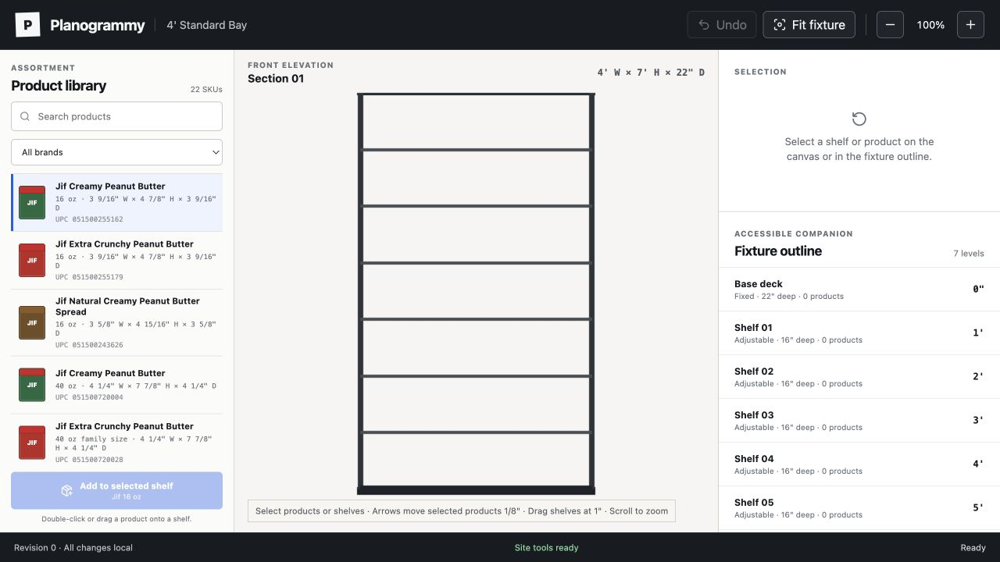
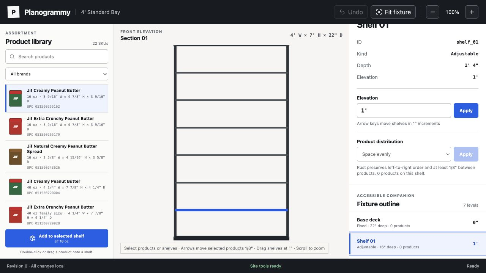
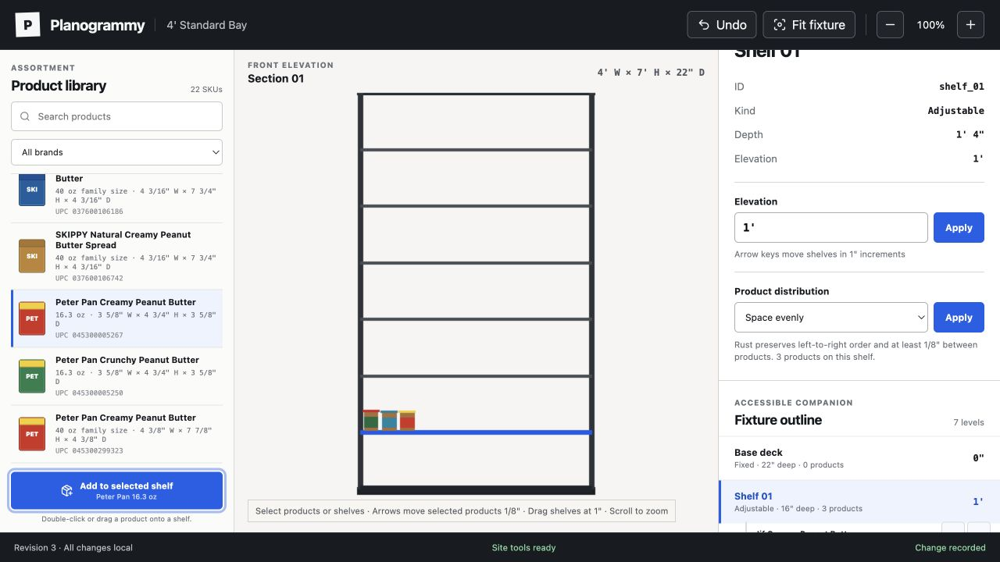
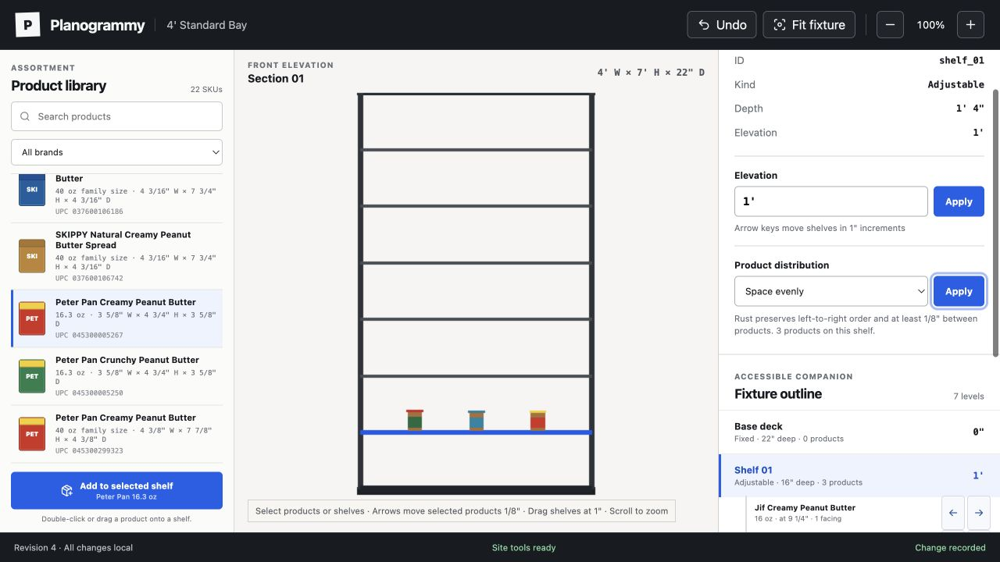
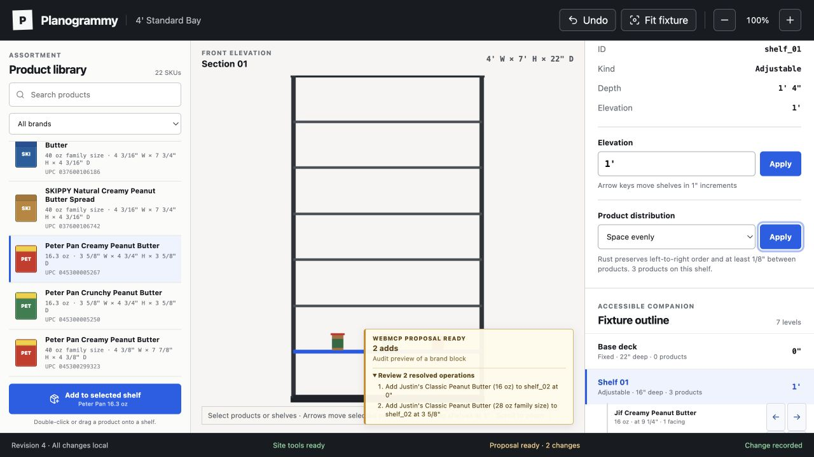
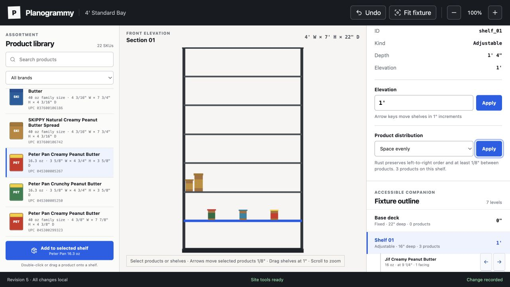

# Planogrammy compelling-product audit

## Verdict

Planogrammy already has a credible deterministic editor and a working WebMCP proposal path. What is missing is a product story that turns those mechanics into an obvious merchandising outcome. The strongest next slice is a first-class AI review mode: show the intent, before/after layout, business impact, validation, and explicit approval in one place.

## Evidence

1. **Empty editor — structurally sound, weak first payoff.** The three-column workspace is clear, but the blank fixture asks the user to invent the first task and does not demonstrate why Planogrammy is different.
   

2. **Shelf selected — healthy mechanics, too implementation-led.** Exact elevation and distribution controls inspire trust, but IDs, dimensions, and duplicate Apply buttons dominate over a goal-oriented workflow.
   

3. **Products added — working, visually under-expressive.** Products respect physical dimensions and the revision updates, but tiny brand blocks do not communicate a convincing shelf strategy or realistic facings.
   

4. **Space evenly — technically strong, commercially unexplained.** Deterministic distribution is visible, but there is no capacity, utilization, assortment, brand-block, or rule impact to explain whether the result is good.
   

5. **AI proposal — differentiating capability, weak review moment.** The live WebMCP proposal works and stays non-mutating, but the review is a small overlay on the canvas with no visible before/after ghost, impact summary, or human approve/reject controls.
   

6. **AI proposal applied — healthy command path, incomplete professional workflow.** The proposal applies atomically, attributes the actor, increments one revision, and updates both canvas and accessible outline. The experience still ends at a local revision instead of a named version, comparison, approval, export, or publish milestone.
   

## Highest-impact changes

1. Make `brief -> proposal -> review -> approve` the central journey.
2. Turn the proposal overlay into a review workspace with before/after canvas states, grouped operations, actor/reason, validation, capacity impact, and Accept/Reject/Revise/Undo actions.
3. Start with a believable seeded planogram or a one-click merchandising task so the first screen demonstrates value immediately.
4. Add decision signals: shelf utilization, facings, assortment coverage, gaps, constraint status, and dimension confidence.
5. Increase canvas and product readability without requiring packshots: clearer brand labels, facing counts, semantic zoom, and richer selected/changed states.
6. Complete the professional trust loop with saved versions, history, compare, and a clear publish/export boundary.

## Accessibility notes

The HTML fixture companion, semantic controls, keyboard hints, focus treatment, and live revision/status text are strong. Visible risks are the 9–11 px product/help/status copy, a dense scrolling companion, and an AI proposal that uses very small text over the canvas. A complete keyboard order, screen-reader announcement, contrast, zoom/reflow, and error-recovery audit was outside this pass.

## Evidence limits

This pass covered the desktop local editor, shelf selection, product placement, distribution, live WebMCP preview/apply, accessibility structure, and console warnings/errors. It did not cover mobile reflow, pointer dragging, every keyboard path, persistence, authentication, publishing, or multi-version comparison.
